# 📘 Manual de Usuario – OWTunnel

¡Bienvenido a OWTunnel! Descubre cómo proteger tu conexión y gestionar todo tu servicio VPN de forma sencilla y visual.  
*Este manual abarca la App VPN para usuarios y la App de Gestión Administrativa.*

---

## Índice

1. [Introducción](#introducción)
2. [Requisitos mínimos](#requisitos-mínimos)
3. [App VPN para Usuarios](#app-vpn-para-usuarios)
    - [Pantallas principales y funciones](#pantallas-principales-y-funciones)
    - [Registro e inicio de sesión](#registro-e-inicio-de-sesión)
    - [Gestión de suscripción y ajustes](#gestión-de-suscripción-y-ajustes)
    - [Historial y exportación](#historial-y-exportación)
    - [Soporte y preguntas frecuentes](#soporte-y-preguntas-frecuentes)
4. [App de Gestión Administrativa](#app-de-gestión-administrativa)
    - [Pantallas principales](#pantallas-principales-gestión)
    - [Gestión de usuarios](#gestión-de-usuarios)
    - [Gestión de planes, pagos y servidores](#gestión-de-planes-pagos-y-servidores)
    - [Panel de control y métricas](#panel-de-control-y-métricas)
5. [Contacto y soporte](#contacto-y-soporte)

---

## Introducción

🌍 **OWTunnel** es tu solución para navegar seguro, privado y sin límites, tanto en dispositivos móviles como en escritorio.  
La solución incluye dos aplicaciones:

- **App VPN de usuario:** conecta y navega seguro desde cualquier lugar.
- **App de gestión administrativa:** controla usuarios, servidores, pagos y más desde un panel avanzado.

---

## Requisitos mínimos

- **App VPN Usuario:**
    - Android 7.0+ 📱 / Windows 10+ 🖥️ / Linux (Ubuntu 20.04+) 🐧
    - Internet
    - Correo electrónico válido
- **App de Gestión:**
    - Windows 10+ recomendado
    - Internet
    - **Cuenta con rol de Soporte (SUPPORT) o Administrador (ADMINISTRATOR)**

---

## App VPN para Usuarios

### Pantallas principales y funciones

#### 1. Pantalla de Bienvenida y Registro
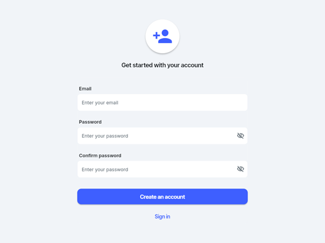
 *Regístrate fácilmente con tu email y contraseña. Recibe un correo de activación para mayor seguridad.*

#### 2. Inicio de Sesión
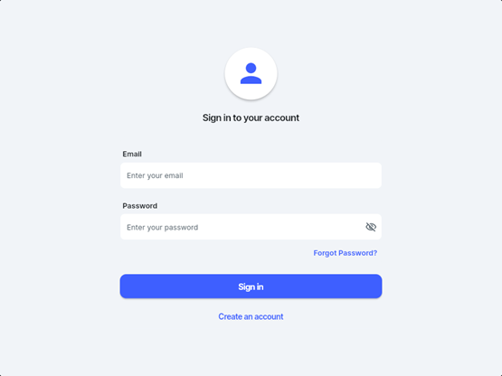
 *Introduce tus datos para acceder o utiliza el enlace de recuperación si lo necesitas.*

#### 3. Recuperación y cambio de contraseña
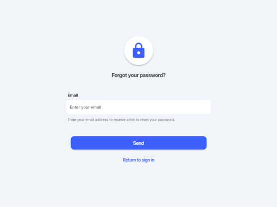
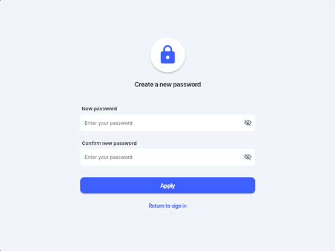
 *Solicita la recuperación introduciendo tu correo. Recibe un enlace y elige nueva contraseña.*

#### 4. Dashboard Principal
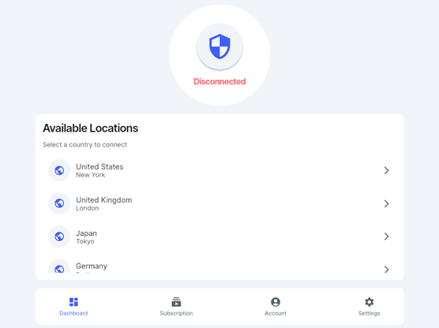
 *Elige manualmente el país/ciudad.*
- Estado de conexión VPN (Conectado / Desconectado) 🟢🔴
- IP virtual asignada
- Botón grande para Conectar / Desconectar
- Lista de servidores por país/carga
- Acceso rápido al menú de ajustes ⚙️

#### 5. Gestión de Suscripción
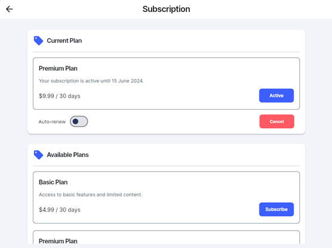
- Consulta tu plan actual 🏷️
- Cambia de plan cuando lo necesites
- Activa o desactiva la renovación automática
- Realiza pagos seguros (tarjeta, PayPal, etc.) 💳

#### 6. Cuenta y Ajustes
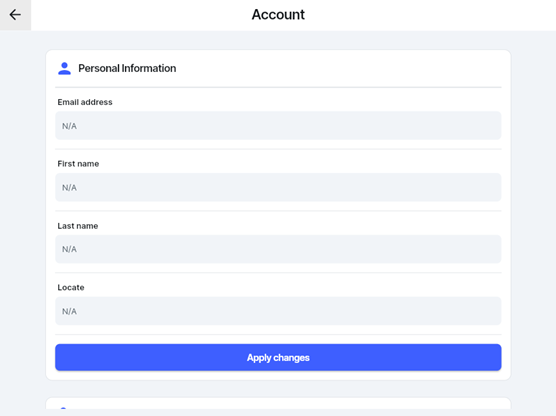
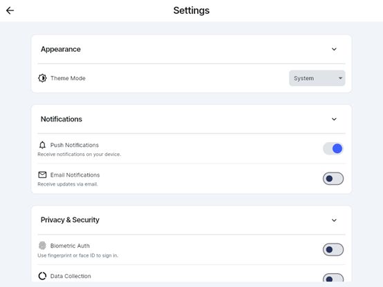
- Gestiona notificaciones, privacidad y seguridad
- Edita tus datos personales y contraseña 📝
- Cambia el tema visual (oscuro/claro) 🌗
- Cambia idioma (español/inglés) 🌐

---

### Registro e inicio de sesión

1. **Registrarse:**
   - Pulsa en “Registrarse”, completa tus datos y revisa tu correo para activación.
2. **Inicio de sesión:**
   - Introduce tus credenciales. Si olvidas tu contraseña, haz clic en “¿Olvidaste tu contraseña?” y sigue los pasos.

### Gestión de suscripción y ajustes

- Accede a tu **plan actual**, cambia de suscripción, o ajusta la renovación automática.
- Configura las opciones de idioma, tema y notificaciones desde la sección de ajustes.
- La app te notificará cualquier cambio de estado (conexión, pago, vencimiento, etc.).

### Historial y exportación

- Desde el historial visualiza conexiones previas y expórtalas en PDF o CSV para llevar un control externo.

### Soporte y preguntas frecuentes

- Si tienes dudas o necesitas ayuda, accede a la sección “Soporte” o consulta las preguntas frecuentes en la app.
- Preguntas típicas:
    - **¿Puedo usar mi cuenta en varios dispositivos?** Sí, según tu plan contratado.
    - **¿La app almacena mis datos de navegación?** No, solo información necesaria para tu seguridad y conforme al RGPD.

---

## App de Gestión Administrativa

### Pantallas principales (gestión)

#### 1. Dashboard administrativo

- Vistas de usuarios totales, conexiones activas y estadísticas principales 📊
- Accede al registro de actividad administrativa

#### 2. Gestión de Usuarios
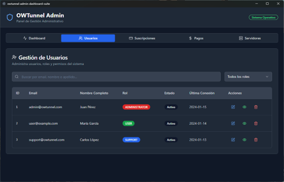
- Busca, edita, bloquea o elimina usuarios
- Asigna roles: Usuario, Soporte o Administrador

#### 3. Gestión de Suscripciones
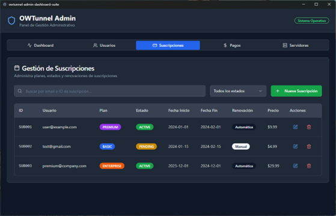
- Lista de suscripciones activas, pendientes o expiradas
- Cambia estado, crea planes, modifica precios o moneda

#### 4. Gestión de Pagos
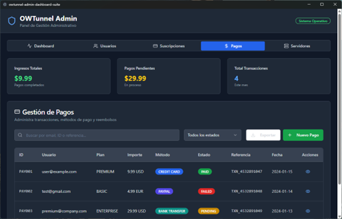
- Revisa transacciones, estados y métodos de pago
- Procesa reembolsos si es necesario

#### 5. Gestión de Servidores VPN
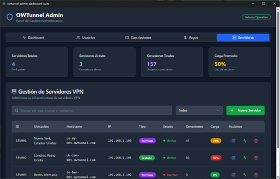
- Añade, edita o elimina servidores
- Consulta estado, carga y tipo (gratuito/premium)

---

### Gestión de usuarios

- Accede al listado completo de usuarios, busca por email o nombre.
- Edita información, cambia roles, bloquea/desbloquea cuentas.
- Consulta historial de conexiones y pagos de cada usuario.

### Gestión de planes, pagos y servidores

- Crea y edita planes de suscripción: nombre, duración, precio y moneda.
- Gestiona pagos realizados, verifica el estado de transacciones y procesa reembolsos.
- Añade, edita o elimina servidores VPN y monitoriza su disponibilidad.

### Panel de control y métricas

- Consulta estadísticas de uso, ingresos, usuarios activos y estado de servidores.
- Revisa alertas y notificaciones críticas para el soporte técnico.

---

## Contacto y soporte

📧 Para soporte, dudas o sugerencias:

- **Email:** soporte@owtunnel.com
- **Documentación oficial y repositorio:** [https://github.com/mike-educantabria/OWTunnel](https://github.com/mike-educantabria/OWTunnel)
